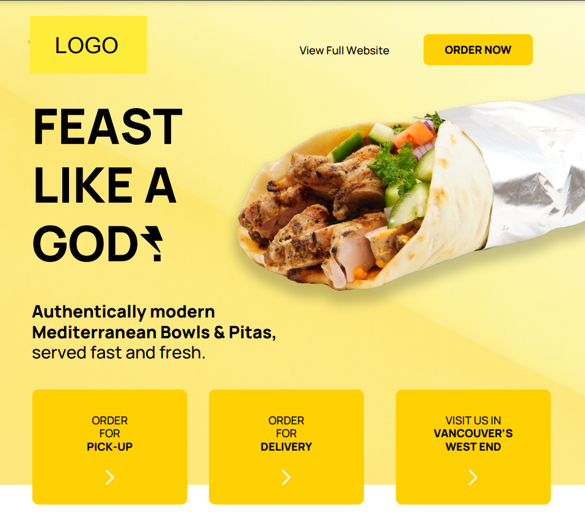
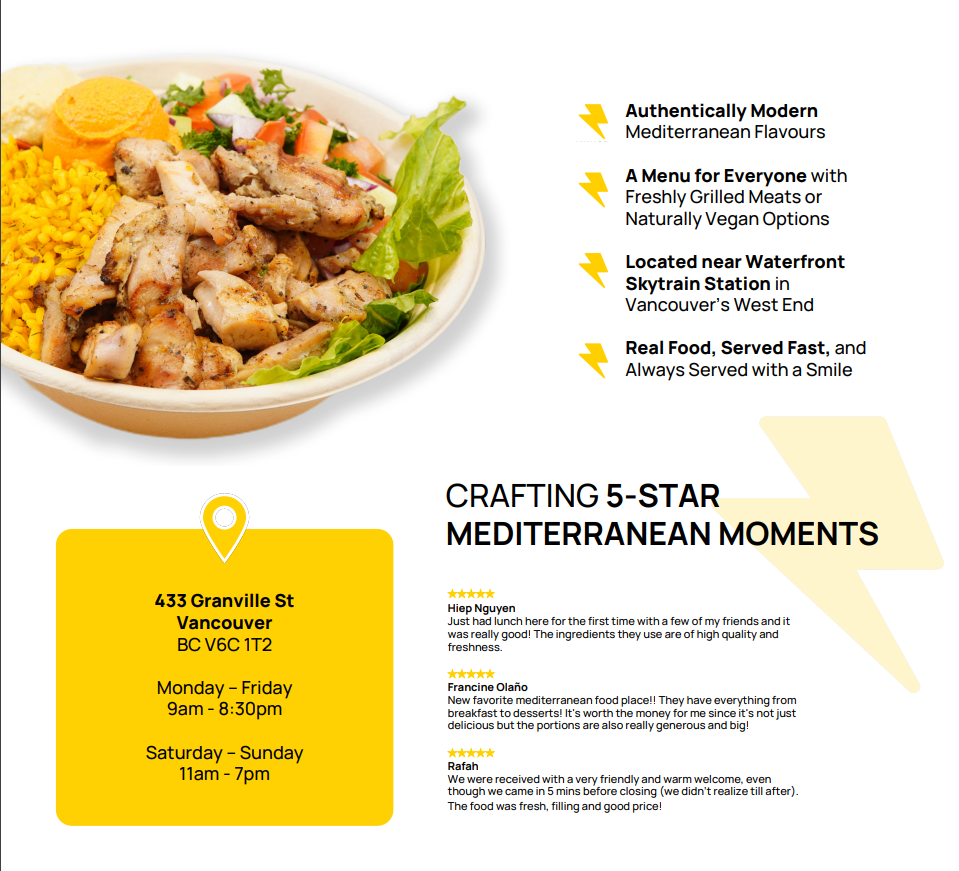
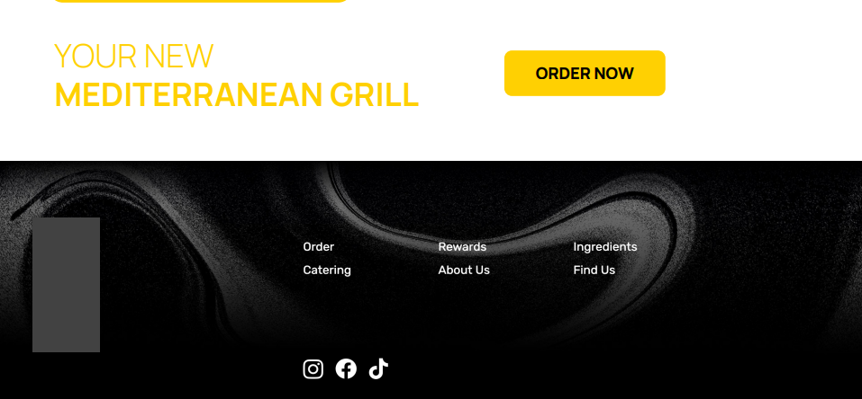

# Food Ordering Platform

This is a Laravel project that serves as a food ordering platform. It utilizes the Voyager admin panel and PostgreSQL as the database. The platform provides an interactive frontend using the Blade template engine and a backend powered by PHP Laravel.




## Installation

To get started with the Food Ordering Platform, follow these steps:

1. Clone the repository to your local machine:

    ```bash
    git clone https://github.com/your-username/food-ordering-platform.git
    ```

2. Navigate to the project directory:

    ```bash
    cd food-ordering-platform
    ```

3. Install the project dependencies using Composer:

    ```bash
    composer install
    ```

4. Create a new PostgreSQL database for the project.

5. Configure the database connection in the `.env` file. Update the following lines with your database credentials:

    ```dotenv
    DB_CONNECTION=pgsql
    DB_HOST=127.0.0.1
    DB_PORT=5432
    DB_DATABASE=your_database_name
    DB_USERNAME=your_username
    DB_PASSWORD=your_password
    ```

6. Generate a new application key:

    ```bash
    php artisan key:generate
    ```

7. Run the database migrations and seed the initial data:

    ```bash
    php artisan migrate --seed
    ```

8. Start the development server:

    ```bash
    php artisan serve
    ```

9. Open your web browser and visit `http://localhost:8000` to access the Food Ordering Platform.

## Laravel

The backend of the Food Ordering Platform is built using the Laravel framework. Laravel provides a robust and elegant way to develop web applications with PHP. It offers features like routing, database migrations, authentication, and more, making it a popular choice for building modern web applications.

For more information about Laravel, please refer to the official documentation: [https://laravel.com/docs](https://laravel.com/docs)
